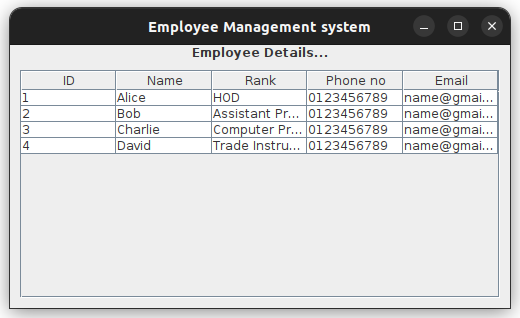

# Employee Management System

This project is an Employee Management System (EMS) built using Java Swing & MySQl. It creates a graphical user interface (GUI) that displays employee details such as ID, name, rank, phone number, and email in a table format. The program is designed to showcase employee information in a clean, user-friendly window.

<div align="center">
  <br>
  
  <br>
</div>

## Features

> Manage employee records.
> Maintain employee data.
> Perform CRUD operations on employee information.
> Create, modify, or delete employee details.

## Technology used

- Java(GUI)
- MySQL(DB)

### Prerequisites

- Java installed on your machine

#### Install java compiler in linux

```bash
sudo apt install default-jre
```

##### Steps(Linux)

1. Clone the Repository

```bash
git clone https://github.com/NayanUnni95/EMS.git;
cd EMS
```

2. Execute java file using javac compiler

```bash
javac Main.java
```

3. Run class file

```bash
java Main
```

### License

This project is licensed under the MIT License. See the [LICENSE](./LICENSE) file for details.
